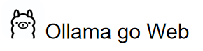
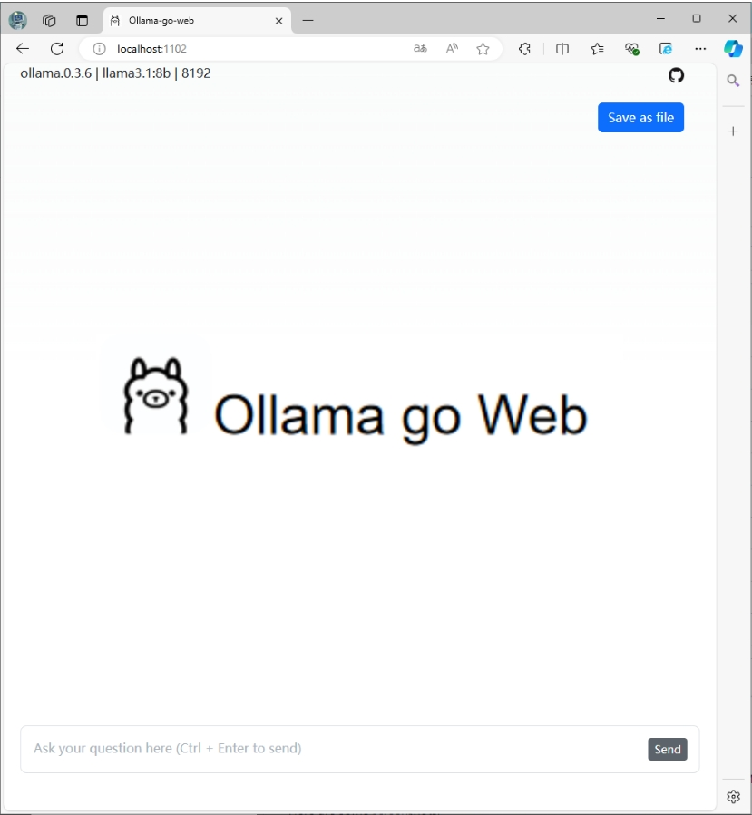
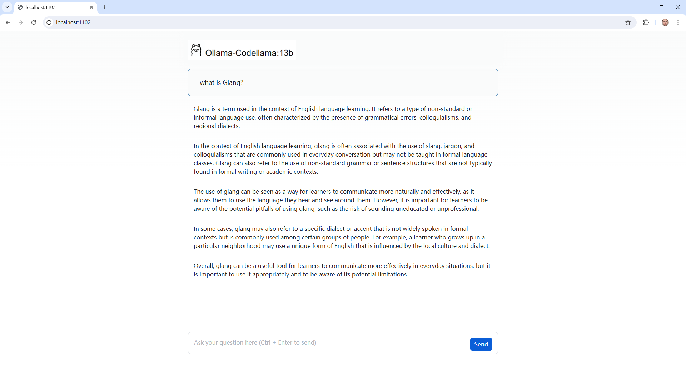
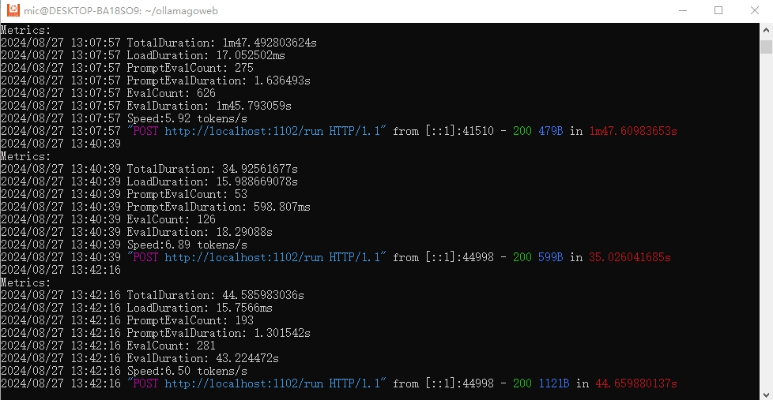
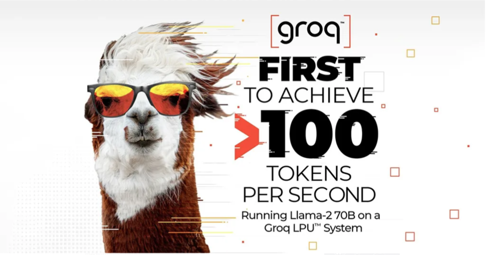

ollamagoweb is a simple ChatGPT clone built with Go. It uses Llama-compatible LLMs, through ollama.

Here are some screenshots.

1.Starting screen.

2.Answering the question "What is the TOTP?", and continue the discussion in context.

3.For each round of dialogue, you can click the button in the upper right corner to delete it.

4.The backend server displays and calculates the session's token and speed.

# Models

You can download various LLM models from https://www.ollama.com

# edit .env 
You can setting the port and llm by edit the .env file

`PORT=1102`

`llm=codellama:latest`

# run the servcie
`cd ollamagoweb`

`go mod tidy`

`go run main.go`

# build the .exe

`cd ollamagoweb`

`go build main.go`

`./main`
# Groq support

#1、replace file from GroqGoWeb as below:

`./main.go`

`./.env`

`./static/logo.png`

#2、edit the .env file:

`PORT=1102`

`llm=llama3-8b-8192`

`baseUrl=https://api.groq.com/openai/v1`

`apiKey=gsk_rmxxxxxxxxxxxxxxxxxxxxxxxxxxxxxxxxxxxx0H`

#3、and run 

`go run main.go`
# Groq
you can get Groq free api-key from https://www.groq.com
