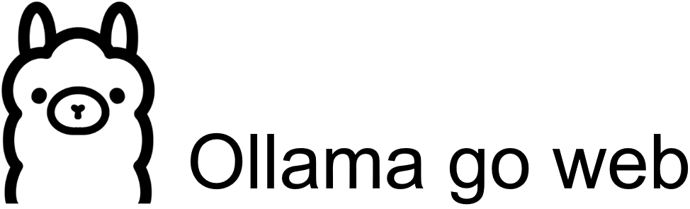

#introuduction:
Introducing ollamagoweb, a simple ChatGPT clone built with Go, utilizing Llama-compatible LLMs through ollama. This innovative tool offers a seamless conversational experience, as showcased in the following screenshots:

Starting Screen The main page displays the Ollama version, LLM tag, and context length, providing essential information for a productive conversation.

Answering Questions and Contextual Discussion ollamagoweb effortlessly responds to questions, such as "What is TOTP?", and continues the discussion in context, allowing for a natural and engaging exchange.

Conversation Management For each round of dialogue, users can conveniently delete the conversation by clicking the button in the upper-right corner, ensuring a clutter-free interface.

Backend Server The backend server efficiently displays and calculates the session's token and speed, providing a robust foundation for the application.

Models and Customization Users can download various LLM models from https://www.ollama.com and customize the application by editing the .env file to set the port and LLM. For instance:

`PORT=1102` 

`llm=codellama:latest`

Running the Service To run the service, simply navigate to the ollamagoweb directory and execute the following commands:

`go mod tidy` 

`go run main.go`

Building the Executable To build the executable, users can run the following commands:

`cd ollamagoweb` 

`go build main.go` 

`./main`

Groq Support ollamagoweb also supports Groq, allowing for fast and efficient conversations. To enable Groq support, follow these steps:

Replace the necessary files from GroqGoWeb.

Edit the .env file to set the port, LLM, base URL, and API key:

`PORT=1102` 

`llm=llama3-8b-8192` 

`baseUrl=https://api.groq.com/openai/v1` 

`apiKey=gsk_rmxxxxxxxxxxxxxxxxxxxxxxxxxxxxxxxxxxxx0H`

Run the application using 

`go run main.go`

Users can obtain a free API key from https://www.groq.com to unlock the full potential of ollamagoweb with Groq support.

ollamagoweb is a simple ChatGPT clone built with Go. It uses Llama-compatible LLMs, through ollama.

Here are some screenshots.

1.Starting screen. show up Ollama version | LLM tag | context lengh.

2.Answering the question "What is the TOTP?", and continue the discussion in context.

3.For each round of dialogue, you can click the button in the upper right corner to delete it.

4.The backend server displays and calculates the session's token and speed.

# Models

You can download various LLM models from https://www.ollama.com

# edit .env 
You can setting the port and llm by edit the .env file

`PORT=1102`

`llm=codellama:latest`

# run the servcie
`git clone https://github.com/ml2068/ollamagoweb.git`

`cd ollamagoweb`

`vim .env`

`go mod tidy`

`go run main.go`

# build the .exe

`cd ollamagoweb`

`go build main.go`

`./main`
# Groq support

#1、replace file from GroqGoWeb as below:

`./main.go`

`./.env`

`./static/logo.png`

#2、edit the .env file:

`PORT=1102`

`llm=llama3-8b-8192`

`baseUrl=https://api.groq.com/openai/v1`

`apiKey=gsk_rmxxxxxxxxxxxxxxxxxxxxxxxxxxxxxxxxxxxx0H`

#3、and run 

`go run main.go`
# Groq
you can get Groq free api-key from https://www.groq.com
